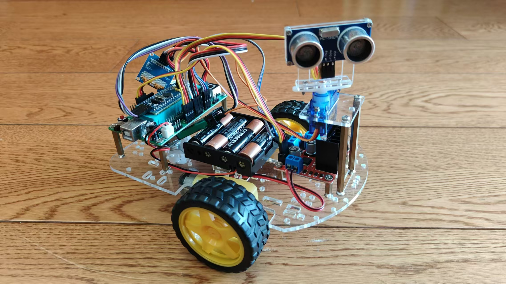

# Smart Car

## Hardware

- 循迹/避障/遥控小车底盘 + 车轮 + 万向轮 
- 主控： STM32F103C8T6 芯片 和 STM32 扩展板
- L289n 双H桥电机驱动模块
- 2-4路 TT电机
- 红外循迹模块
- 红外避障模块
- 红外遥控模块
- 超声波避障模块： 超声波模块 + SG90舵机 + 云台支架 + 
- 蓝牙控制模块
- PS2手柄遥控 2.4G 无线技术
- SBUS 航模遥控器

## driver

